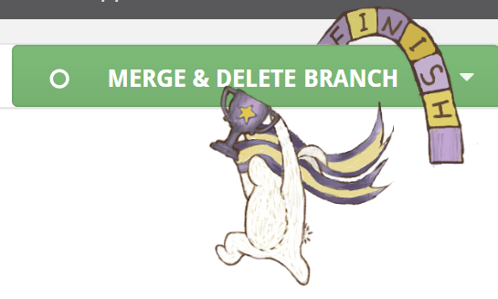

# Submitting Your Work

## Pull Request title and description

Your PR title needs to follow the [Semantic PR](https://github.com/zeke/semantic-pull-requests) or the [Conventional Commits Specification](https://www.conventionalcommits.org/) \
e.g. `fix: fix the infamous bug`. Common types: `feat` (for feature), `fix`, `docs`.


We follow [Semantic Versioning](https://semver.org/) in this project. The build version automatically gets bumped up based on the content of the PR title and description.&#x20;


On the PR description, please include **fixes: #issue-number**. This will [link the PR to the issue you're working on](https://docs.github.com/en/issues/tracking-your-work-with-issues/linking-a-pull-request-to-an-issue#linking-a-pull-request-to-an-issue-using-a-keyword).&#x20;

**By contributing to the project and/or associated repositories (**[**Portal**](https://github.com/ocadotechnology/codeforlife-portal)**,** [**Rapid Router**](https://github.com/ocadotechnology/rapid-router) **and** [**Aimmo**](https://github.com/ocadotechnology/aimmo)**,** [**Appengine**](https://github.com/ocadotechnology/codeforlife-deploy-appengine)**), you agree to abide by the** [**licence**](https://github.com/ocadotechnology/codeforlife-portal/blob/master/LICENSE.md) **including future changes. Update notices will be posted on the** [**release page**](https://github.com/ocadotechnology/codeforlife-portal/releases)**.**&#x20;

## Unit tests

Include unit tests when you contribute new features, as they help to a) prove that your code works correctly, and b) guard against future breaking changes to lower the maintenance cost. It's important to minimise human checking.

Bug fixes also generally require unit tests, because the presence of bugs usually indicates insufficient test coverage.

You can create a [draft PR](https://github.blog/2019-02-14-introducing-draft-pull-requests/) to indicate that it's still work in progress and check whether all the tests pass, before changing the status to "Ready for review". We use [codecov](https://about.codecov.io/) to ensure a good test coverage percentage.&#x20;

We use [pytest](https://docs.pytest.org/) for python unit tests, and [cypress](https://www.cypress.io/) for the UI/frontend. There are still older tests with selenium and python `unittest`, but we aim to eventually migrate everything to `pytest` and cypress. All tests can be run with running `pytest`.  To run selenium tests, you need [chromedriver](https://chromedriver.chromium.org/getting-started) installed.&#x20;

## Code review

We perform code review process for every change, whether internally or externally. We use [Reviewable](https://reviewable.io/) for this. You should get an email notification when someone leaves a review for your PR. If not, please check your email settings, and keep an eye on the Reviewable section of your PR.&#x20;

Based on the review, you may have to go back and make updates, or you could comment to answer questions or justify your code. This review process may go back and forth a few times.&#x20;

**We encourage a collaborative environment where anyone can review anyone's PR.** Code reviewing is not reserved for core developers only, and multiple people can review someone's PR.&#x20;

Once the review is complete and approved, the branch is ready to be merged.

## Merging a pull request

Generally the core developers will need to merge the PR. You should get a notification when this happens.

If you're a regular developer and have obtained a write access to the repo, you will see a victory graphic appears on top of Reviewable page, and you can merge the PR by clicking the 'Merge & Delete branch':

## Release

Congratulations! 🎉

At this point your work will have successfully merged into the main branch and go into [the staging server](https://staging-dot-decent-digit-629.appspot.com/). Next it will be deployed to production together with the other changes on the next deployment.&#x20;

The [Release Notes](../about/release-notes.md) is updated on every deployment so please check the page for updates. Depending on what we're working on, we may deploy a couple of times a week or a couple of times a month.&#x20;

## End of the cycle

If you have come this far, thank you. We appreciate the time and effort you have put into this 🙏. We hope that you've learned tonnes, enjoyed the process, and decide to continue helping us out.

There are many other ways that you can contribute. Testing, reporting issues, suggesting ideas, promoting the project - are some of the things that are very useful. Creating artwork or helping with translation are the others. Feedback for this documentation is very welcome too. Get in touch to find out how else you can help.
